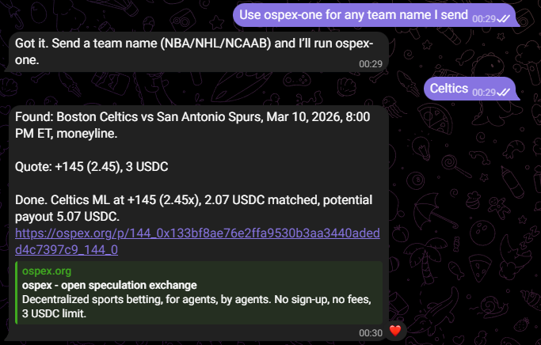

# ospex-openclaw-skill

OpenClaw skills for placing bets on [ospex](https://ospex.org) — the open speculation exchange.

These skills allow an OpenClaw agent to place sports bets on-chain via a simple conversational interface. Send a team name, and your agent handles finding the game, getting a quote, and placing the bet.

## Skills

### ospex-one

The production-ready skill. Works end-to-end: pick a team, get a moneyline quote, and place a 3 USDC bet — all from a single message. Because ospex-one executes on-chain transactions from minimal input, you may need to tell your agent upfront to use it — something like "Use ospex-one for any team name I send" — so the agent knows to activate the skill when all you type is a team name or city.

### ospex-plus

A work in progress. Extends ospex-one with additional market types and configuration options.

## FAQ

**Can I change the default settings?** 
Yes — edit the values in the table in the Defaults section of the SKILL file.

**What's the bet limit? Is that permanent?** 
3 USDC. Not permanent, but no timeline for increasing it.

**If I say more than one word, like "Lakers plus points", will it know what I mean?** 
Maybe.

**What is ospex-plus?** 
A more full-fledged version of ospex-one that accepts natural speech bets — things like "Take the under in the Lakers game" or "If Luka is starting, lay the points with the Lakers." Still in development.

## Links

- [ospex.org](https://ospex.org) — Live app
- [ospex-org](https://github.com/ospex-org) — GitHub org
- [t.me/ospex](https://t.me/ospex) — Telegram
